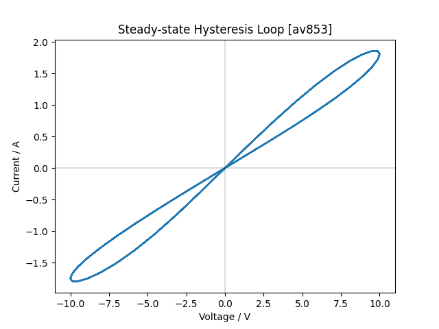
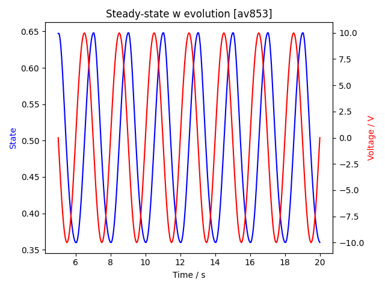
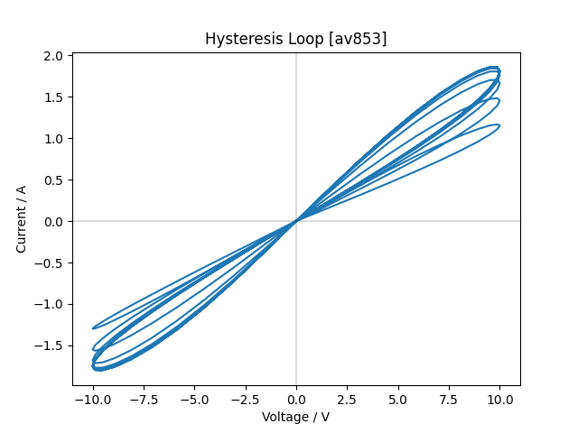

# Memristor Simulation
## Overview
A memristor is a component that remembers the past charge through it. It was proposed as the fourth fundemental circuit component by Leon Chua in 1971 [[1]](#1)  
Concrete physical manifestations of this device were proposed by Strukov et al. in 2008 [[2]](#2)  
The fundemental equations for this device are [[1]](#1):  

$v=M(w, i)i$  

$\dfrac{dw}{dt} = f (w,i)$  

However due to the difficulty in manufacturing these devices, an approach to approximate/simulate them can be taken by using photochromic dye.  
The equations can therefore be simplified, specifically:

$v = M(w) i$

and more usefully,  

$i = \frac{v}{M(w)}$

Where the resistance of the memristor is determined solely by its current state.  

## Implementation  
To get the resistance, I lerp between $R_{on}$ and $R_{off}$ where $R_{on}$ is the resistance of the component in its most conductive state, and $R_{off}$ is the resistance in the least conductive state.  
`Roff + (Ron - Roff) * _currentState`  
Where the current state is a dimensionless quantity between 0 and 1.  

To get the current state, from $\dfrac{dw}{dt} = f (w,i)$, $f(w,i)$ must satisfy the following:  
For a current $i$  
$i > 0$, must result in an increase in the state, towards the maximum value (1).  
$i < 0$, must result in a decrease in the state, towards the minimum value (0).  
$i = 0$, must result in no change in state, to hold the value.  

Therefore I implement this as a piecewise function  
```cs
float dwBydt = 0;
// move towards maximum w
if(current > 0) dwBydt = current * (1-_currentState) * alpha;
// move towards minimum w
else if(current < 0) dwBydt = current * _currentState * beta;
return dwBydt;
```
where `alpha` and `beta` are coefficients to control the rate of forward and backward switching.  
To get a "fingerprint" for a memristor, it is best to plot the Lissajous figure from its IV characteristics.   
For,  
$ω = \pi [\frac{rad}{s}]$  
$V_{max} = 10 [V]$  
$R_{off} = 10 [Ω]$  
$R_{on} = 1 [Ω]$  
$w = 0.35$  
$α = 0.5$  
$β = 0.5$  

### Steady state responses
*figure 1*|*figure 2*
:---:|:---:
|

  
### Transient responses
*figure 3*|*figure 4*
:---:|:---:
|

## References
<a id="1">[1]</a>
L. Chua, "Memristor-The missing circuit element," in IEEE Transactions on Circuit Theory, vol. 18, no. 5, pp. 507-519, September 1971.  
<a id="2">[2]</a>
Strukov, D., Snider, G., Stewart, D. et al. "The missing memristor found," Nature 453, 80–83, May 2008.
