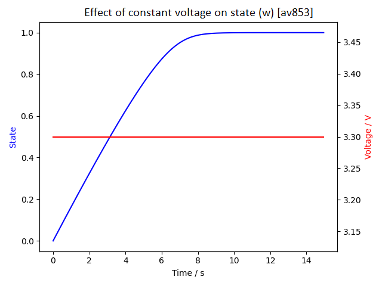
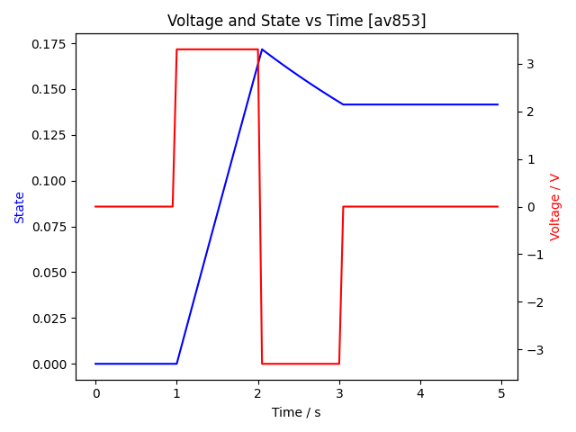
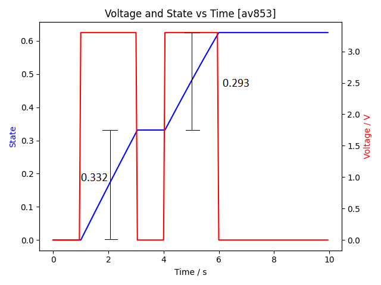
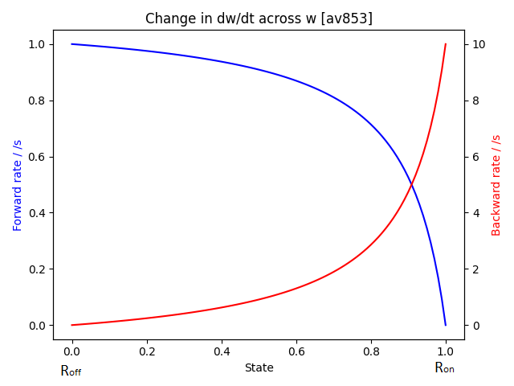
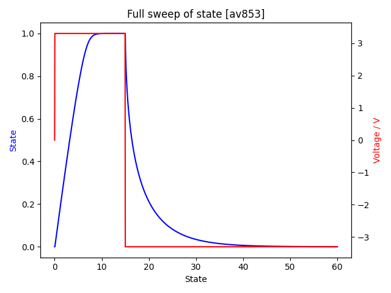

# Memristor Simulation
## Overview
A memristor is a component that remembers the past charge through it. It was proposed as the fourth fundamental circuit component by Leon Chua in 1971 [[1]](#1)  
Concrete physical manifestations of this device were proposed by Strukov et al. in 2008 [[2]](#2)  
Memristors allow for the storage of a theoretically infinite number of states, [0, 1], limited by the SNR of the read out signal.  
Creating real memristors at any scale or for independant research is untenable. Therefore instead of simulating voltage controlled memristors, a light controlled photochromic approximation is being modelled instead. The set of results obtained in this project aim to reinforce the characteristics of a photochromic memristor.


## Implementation
The fundamental equations for this device are: [[1]](#1)  

$$v=M(w, i)i$$  
$$\dfrac{dw}{dt} = f (w,i)$$  

$v$ is the voltage across the memristor  
$M(w, i)$ is the function for memristance [Ω]  
$i$ is the current through the memristor  
$w$ is the state of the memristor

In this simulation, I use the simplified equation,

$$v = M(w) i$$

and more usefully,  

$$i = \frac{v}{M(w)}$$

Where the resistance of the memristor is determined solely by its current state.  

$$M(w) = R_{on} + (R_{off} - R_{on}) \cdot w$$  

$$R_{on} \space \leq \space M(w) \space \leq \space R_{off}$$  

Where $R_{on}$ is the resistance of the component in its most conductive state, and $R_{off}$ is the resistance in its most resistive state, such that $R_{on} < R_{off}$  

To determine $\frac{dw}{dt}$, $f(w,i)$ must satisfy the following:  
For a current $i$  
$i > 0$, must result in an increase in the state, towards the maximum value (1).  
$i < 0$, must result in a decrease in the state, towards the minimum value (0).  
$i = 0$, must result in no change in state, to hold the value.  

$$
f(w,i) =
  \begin{cases} 
      \hfill \ i \cdot (1-w) \cdot \alpha    \hfill & \text{ $i > 0$} \\
      \hfill \ 0    \hfill & \text{ $i = 0$} \\
      \hfill \ i \cdot w \cdot \beta    \hfill & \text{ $i < 0$} \\
  \end{cases}
$$

## Programming  
To get the resistance, I interpolate between $R_{on}$ and $R_{off}$   
`Roff + (Ron - Roff) * _state`  

`_state` is a dimensionless quantity between 0 and 1.  

To get the current state, from $\dfrac{dw}{dt} = f (w,i)$  

I implement this as a piecewise function  
```cs
float dwBydt = 0;
// move towards maximum w
if(current > 0) dwBydt = current * (1-_state) * alpha;
// move towards minimum w
else if(current < 0) dwBydt = current * _state * beta;
return dwBydt;
```
where `alpha` and `beta` are coefficients to control the rate of forward and backward switching.  

*N.B., 'switching' and 'conversion' are used interchangeably in this project, however switching may refer to the electronic process while conversion may refer to the chemical process.*  

## Modelling and Analysis
Each molecule of dye is independent of each other. However at the population level, can be modelled to be deterministic and predictable, where the rate of conversion decreases as more molecules convert,

$0 \leq w \leq 1$

$w \rightarrow 1; \space R \rightarrow R_{on}; \space \dfrac{dw_{forward}}{dt} \rightarrow 0$  

$w \rightarrow 0; \space R \rightarrow R_{off}; \space \dfrac{dw_{backward}}{dt} \rightarrow 0$  

To get a "fingerprint" for a memristor, it is best to plot the Lissajous figure from its IV characteristics. This allows us to see the pinched hysteresis loop that is characteristic of memristive behaviour.   
For,  
$ω = \pi \space [\frac{rad}{s}]$  
$V_{max} = 10 \space [V]$  
$R_{off} = 10 \space [Ω]$  
$R_{on} = 1 \space [Ω]$  
$w = 0.35$  
$α = 0.5$  
$β = 0.5$  

### Steady state responses
|
:---:|:---:
*figure 1*|*figure 2*

Note that in figure 1 when $V = 0$, $I = 0$; the characteristic "pinched" loop.  
In figure 2 voltage and state are in quadrature, as state is related to the integral of voltage.

### Transient responses
|
:---:|:---:
*figure 3*|*figure 4*

## Practical use as a logic device
The inherent non-linearity of the memristor results in difficulty managing the state of the component.  

||
|:---:|
|*figure 5*|  

Ideally, we would like the rate of change of state to be independent of the state itself. However, a memristor is a **non-linear, time-variant system**, which results in the following:

|
:---:|:---:
*figure 6*|*figure 7*

*figure 6*, From $w_{0}$, successive identical but opposite pulses in voltage do **not** result in a return to $w_{0}$  
*figure 7*, From $w_{0}$, $n$ successive identical pulses in voltage do **not** result in a linear increase $\therefore w_{new} \neq n \cdot (\Delta w) + w_0$

The full relationship between the rate of change of state and the state itself can be shown in figure 8  

||
:---:|:---:
*figure 8*|*figure 9*

*N.B., the backward rate of change sweeps a range 10× the forward rate of change. This happens because at* $w=1$ *, the memristor is in its most conductive state;* $R_{on}$  
*This results in a larger current passing through the memristor for the same voltage (Ohm's law). And as you'll remember, the memristor's state is current controlled.*

The asymmetry of the forward and backward conversion rates is clearly shown in figure 9, where setting the memristor ($w \rightarrow 1$) takes ~12 seconds, and resetting ($w \rightarrow 0$) takes ~35 seconds, almost 3× as long.  


## References
<a id="1">[1]</a>
L. Chua, "Memristor-The missing circuit element," in IEEE Transactions on Circuit Theory, vol. 18, no. 5, pp. 507-519, September 1971.  
<a id="2">[2]</a>
Strukov, D., Snider, G., Stewart, D. et al. "The missing memristor found," Nature 453, 80–83, May 2008.
