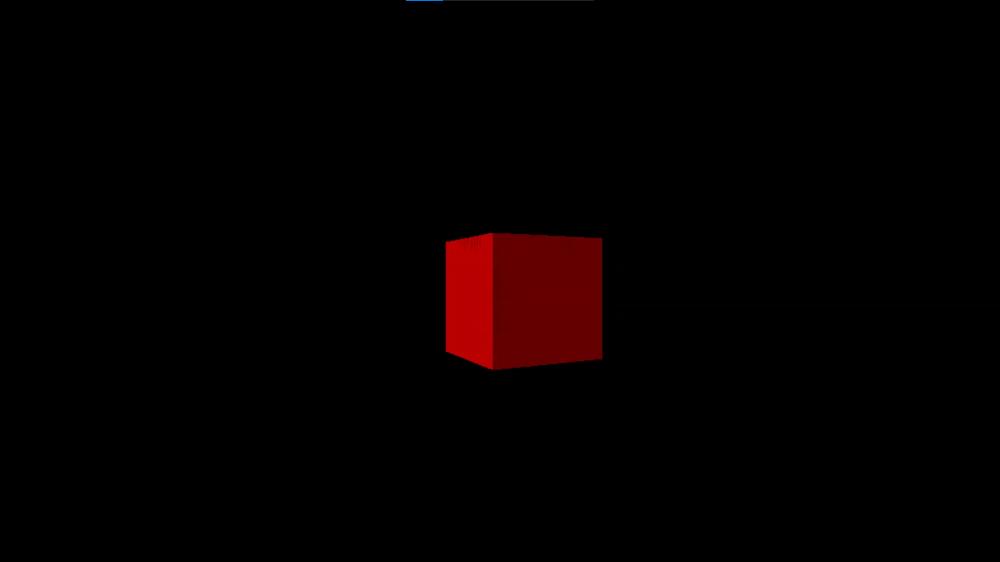
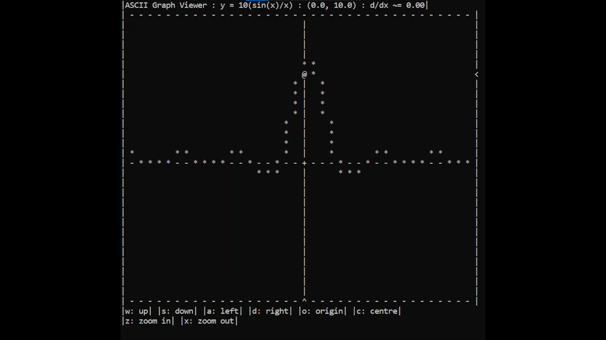
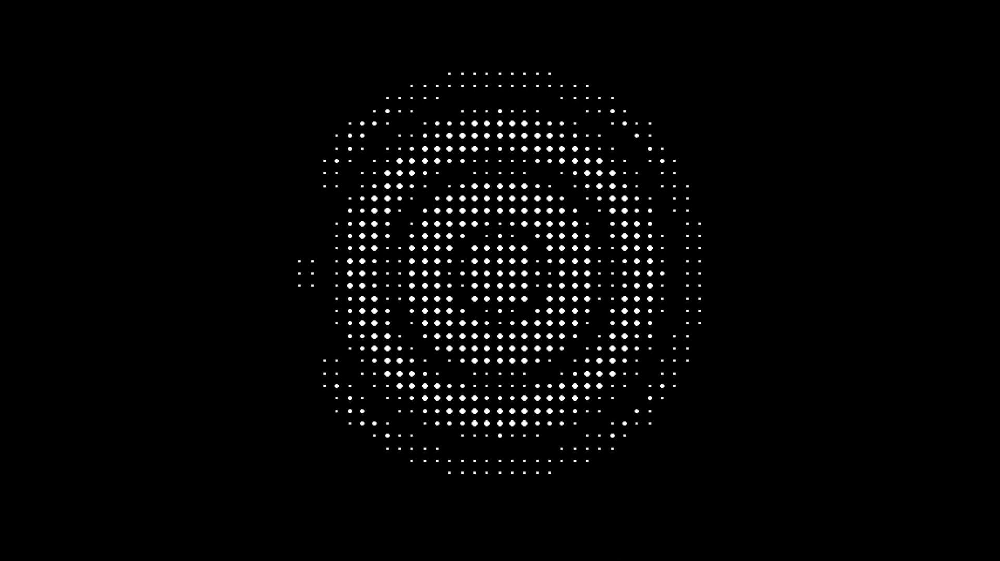
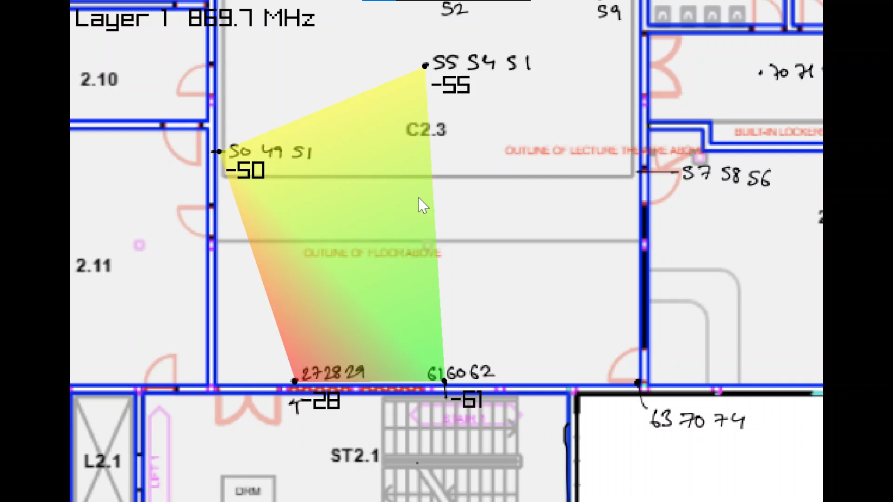
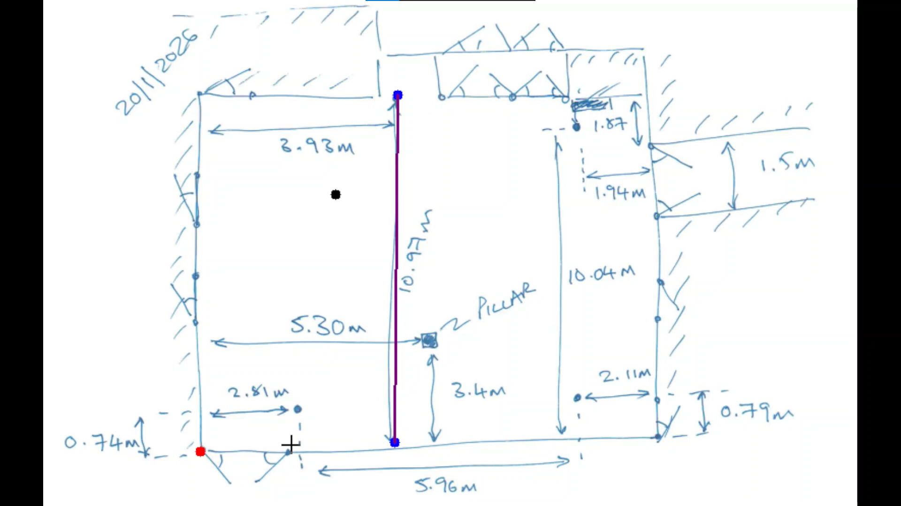

# Excursions
EEE/CSE student.
This repo contains small 1 day - 1 week projects, each done to understand something from first principles.
Click on the links to read more.  

*NB: to run directly downloaded and unzipped python projects please enter the .venv folder*

## Compilers and Low-Level projects
[z8 Processor Core (SystemVerilog)](/z8ProcessorCore/) | [z8 Assembler v2 (C)](/z8Assembler_v2)
:----:|:----:
 | 
| | [z8 Compiler+Emulator (Deprecated) (C)](/z8Compiler/)

## Graphics and Rendering  

[Rasterizer (C#)](/Rasterizer/) | [ASCII Graph Viewer (C)](/ASCIIGraphViewer/)
:----:|:----:
 | 

## Physics Simulations

[Waves 2D (Python)](/Waves2DPython/) | [Waves (C#)](/Waves/)
:----:|:----:
 | 

## Signal Processing
[RF Signal Mapper (C#)](RFMapper/RFHeatmap/) | [RF Position Solver (Python)](/RFMapper/PositionSolverPython/)
:----:|:----:
 | 
