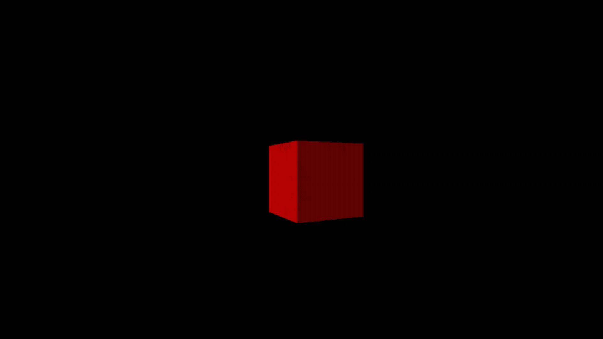
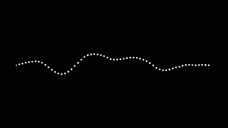

# Excursions
EEE/CSE student.
This repo contains small 1 day - 1 week projects, each done to understand something from first principles.
Click on the links to read more.  

*NB: to run directly downloaded and unzipped python projects please enter the .venv folder*

## Compilers and Low-Level stuff
### [z8 Compiler+Emulator (C)](/z8Compiler/)

## Graphics and Rendering  
### [Rasterizer (C#)](/Rasterizer/)

### [ASCII Graph Viewer (C)](/ASCIIGraphViewer/)

## Physics Simulations
### [Waves 2D (Python)](/Waves2DPython/)

### [Waves (C#)](/Waves/)

## Signal Processing
### [RF Signal Mapper (C#)](RFMapper/RFHeatmap/)

### [RF Position Solver (Python)](/RFMapper/PositionSolverPython/)

