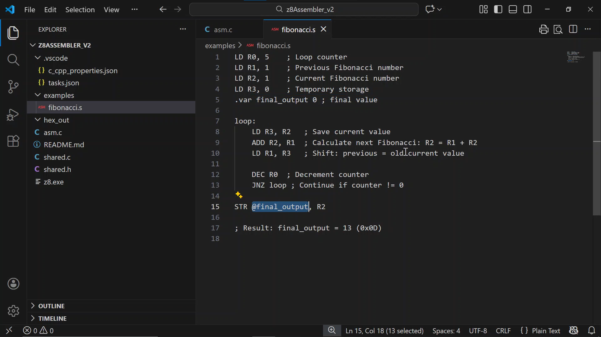

# Z8 Assembler+Emulator (v2)
## Overview
An assembler for my own assembly language, z8. And an accompanying emulator.  
Converts an assembly file to a hex file.  
The hex file can then be run by my [z8 Processor Core](/z8ProcessorCore/), or can be emulated by the z8 Emulator (in this project).    

[](https://youtu.be/_1obpcsb0C4)

## Quickstart
Assemble: `z8 examples/fibonacci.s`  
Run: `emu hex_out/fibonacci.hex`

## Syntax
### Instructions
Operations are written as `OPCODE <dest>, <src>`  

Variables are declared with `.var <name> <value>`  

Labels are declared with `<name>:`  

### Addressing modes
Memory `@<address>` or `@<variable name>`  

Register `R<index>`  

Direct `<value>`

### Bases
Denary `<value>`  

Hex `$<value>`  

Binary `&<value>`  

## How to use
### Assemble a source file
To assemble a program, run `z8 <input_file> [-o <output_file>]`  

Arguments:  
    `<input_file>`  Assembly source file  
    `-o <output_file>`   Output file (optional, default: `<input_file>.hex`)  

### Compile the assembler
You need a C compiler. I use MinGW-w64 and compile with   
```bash
gcc asm.c shared.c -o z8.exe
```

### Emulate a hex file
To emulate an assembled hex file, run `emu <input_file>`  
Arguments:
    `<input_file>` HEX file

### Compile the emulator
You need the same thing as for the assembler, a C compiler. Then run  
```bash
gcc emu.c shared.c -o emu.exe
```

### Examples
Included in `/examples/` is `fibonacci.s` which calculates the fibonacci sequence for $F_7$  
```asm
LD R0, 5    ; Loop counter
LD R1, 1    ; Previous Fibonacci number
LD R2, 1    ; Current Fibonacci number
LD R3, 0    ; Temporary storage
.var final_output 0 ; final value

loop:
    LD R3, R2   ; Save current value
    ADD R2, R1  ; Calculate next Fibonacci: R2 = R1 + R2
    LD R1, R3   ; Shift: previous = old current value

    DEC R0  ; Decrement counter
    JNZ loop ; Continue if counter != 0

STR @final_output, R2
; Result: final_output = 13 (0x0D)
```
After execution, `R2` will contain `0x0D`, the 7th Fibonacci number.  

This example demonstrates:  
- Arithmetic operations (ADD)  
- Register-to-register moves (LD)  
- Conditional branching (JNZ)  
- Loop implementation

It compiles to
```bash
0300000005 # LD R0, 5
0300010001 # LD R1, 1
0300020001 # LD R2, 1
0300030000 # LD R3, 0
0200030002 # loop: LD R3, R2
0600020001 # ADD R2, R3
0200010003 # LD R1, R3
1B00000000 # DEC R0
1700040000 # JNZ loop
fe00000000 # HALT
```
(without the comments)

If assembly was unsucessful, an output file will not be created, and all reached errors are output, e.g.,
```
[Line 2] Error: cannot directly access protected memory 0x0000 - 0x0100
[Line 2] Error: value is out of range [-32768, 32767]
[Line 3] Error: trying to access an undeclared variable/label
```

You can then test your progam without an FPGA or ModelSim by using the emulator;  
Fibonacci output:  
```
R0: 00
R1: 08
R2: 0D
R3: 08
 |00:00| |01:0D| |02:00| ...
 ... |FD:00| |FE:00|>|FF:00|
Overflow: 0
Carry: 0
Negative: 0
Zero: 1
Stack Pointer: FF
```

## Implementation details
It is a case insensistive two-pass assembler.  
### First Pass
Collects labels/variables and stores them in a lookup table

### Second Pass
Parses instructions into machine code, replacing labels/variables with their absolute addresses.  
The assembler decides addressing mode of an instruction from context. Each instruction maps onto multiple opcodes.  
When writing code, the parent instruction is used. `0xFF` is an invalid opcode.

### Instruction set
| Opcode | Memory | Register | Immediate |  
| --- | --- | --- | --- |  
| NOP | 0x00 | 0x00 | 0x00 |  
| LD | 0x01 | 0x02 | 0x03 |  
| STR | 0xFF | 0x04 | 0x05 |  
| ADD | 0xFF | 0x06 | 0x07 |  
| SUB | 0xFF | 0x08 | 0x09 |  
| AND | 0xFF | 0x0A | 0x0B |  
| OR | 0xFF | 0x0C | 0x0D|  
| XOR | 0xFF | 0x0E | 0x0F|  
| CMP | 0xFF | 0x10 | 0x11 |  
| JMP | 0xFF | 0x12 | 0x13 |  
| JZ | 0xFF | 0x14 | 0x15 |  
| JNZ | 0xFF | 0x16 | 0x17 |  
| JN | 0xFF | 0x18 | 0x19 |  
| INC | 0xFF | 0x1A | 0xFF |  
| DEC | 0xFF | 0x1B | 0xFF |  
| PSH | 0xFF | 0x1C | 0x1D |  
| POP | 0x1E | 0x1E | 0x1E |  
| SB | 0x1F | 0x20 | 0xFF |  
| CB | 0x21 | 0x22 | 0xFF |  
| HALT | 0xFE | 0xFE | 0xFE |  

Each instruction is 5 bytes  
- Byte 0: Opcode
- Bytes 1-2: Destination
- Bytes 3-4: Source

*N.B. the control flags live at 0x00, more info in [z8 Processor Core](/z8ProcessorCore/)*

Example:  
`ADD R2, 5 -> 06 0002 0005`

### Full user ISA
#### ADD reg, reg/imm
&rarr; `0x06 ADR` (add register)  
&rarr; `0x07 ADD` (add direct)  
Adds two numbers and stores the result in the src.  

#### AND reg, reg/imm
&rarr; `0x0A ANR` (and register)  
&rarr; `0x0B AND` (and direct)  
Performs the logical and & operator on two numbers and stores the result in the src.

#### CB imm, mem/reg
&rarr; `0x21 CBIM` (clear bit in memory)  
&rarr; `0x22 CBIR` (clear bit in register)  
Sets a bit at index **dest** to 0.

#### CMP reg, reg/imm
&rarr; `0x10 CPR` (compare register)  
&rarr; `0x11 CPD` (compare direct)  
Subtracts src from dest on two numbers and discards the result.

#### DEC reg
&rarr; `0x1B DEC` (decrement register)  
Decrements the value in a register and stores it back in the same register.

#### HALT 
&rarr; `0xFE HALT` (halt program)  
Stops the program from executing any further.

#### INC reg
&rarr; `0x1A INC` (increment register)  
Increments the value in a register and stores it back in the same register.

#### JMP reg/imm
&rarr; `0x12 JPR` (jump to value in register)  
&rarr; `0x13 JPD` (jump to direct)  
Jumps to a specific instruction line/label.  
*! warning - jumping to a number will not jump to the instruction, need to fix.*

#### JN reg/imm
&rarr; `0x18 JNR` (jump to value in register)  
&rarr; `0x19 JND` (jump to direct)  
Jumps to a specific instruction line/label if the negative flag is set.  
*! warning - jumping to a number will not jump to the instruction, need to fix.*

#### JNZ reg/imm
&rarr; `0x18 JNZR` (jump to value in register)  
&rarr; `0x19 JNZD` (jump to direct)  
Jumps to a specific instruction line/label if the zero flag is **not** set.  
*! warning - jumping to a number will not jump to the instruction, need to fix.*

#### JZ reg/imm
&rarr; `0x16 JZR` (jump to value in register)  
&rarr; `0x17 JZD` (jump to direct)  
Jumps to a specific instruction line/label if the zero flag is set.  
*! warning - jumping to a number will not jump to the instruction, need to fix.*

#### LD reg, mem/reg/imm
&rarr; `0x01 LDM` (load memory into register)  
&rarr; `0x02 LDR` (load register into register)  
&rarr; `0x03 LDD` (load value into register)  
Loads a value into a specified register.

#### NOP
&rarr; `0x00 NOP` (no operation)
Does nothing for 1 instruction cycle.

#### OR reg, reg/imm
&rarr; `0x0C ORR` (or register)  
&rarr; `0x0D ORD` (or direct)  
Performs the logical or | operator on two values.  

#### POP reg
&rarr; `0x1E POP` (pop register)   
Pops value at the top of the stack to a register, lowers the stack (stack_ptr++), leaves value behind.  

#### PSH reg/imm
&rarr; `0x1C PSHR` (push register)  
&rarr; `0x1D PSHD` (push direct)  
Pushes a value onto the stack, raises the stack (stack_ptr--).

*Maybe you ask, why are the stack pointer's operations seemingly reversed? Well in this processor, the stack grows downwards from `0xFF` instead of growing upwards!*

#### SB imm, mem/reg
&rarr; `0x1F SBIM` (set bit in memory)  
&rarr; `0x20 SBIR` (set bit in register)  
Sets a bit at index **dest** to 1.

#### STR mem, reg/imm
&rarr; `0x04 STR` (store register)  
&rarr; `0x05 STD` (store direct)  
Stores a value into memory. Can't store directly into variable space [0x01] -> [0x20].

#### SUB reg, reg/imm
&rarr; `0x08 SBR` (subtract register)  
&rarr; `0x09 SBD` (subtract direct)  
Subtracts src from dest and stores the result in dest.

#### XOR reg, reg/imm
&rarr; `0x0E XOR` (xor register)  
&rarr; `0x0F XOD` (xor direct)  
Performs the logical xor ^ operator on two values.

## Improvements on v1
This is a complete re-write of the v1 assembler.  

### Architecture + Design
**Proper addressing modes** - Added MEM, REG, DIR addressing modes with context-sensitive opcocde decomposition  
**Opcode management system** - Stores opcodes and their values in a 2D array `opcode_map[operation][addressing_mode]` for easy lookup and editing  
**Structured data types** - Created `Operation_Mapping` struct to store operation metadata effectively, removing the need for messy 2-array index based lookup  

### Error Handling
**Comprehensive error system** - Added Error_Code to handle 20+ specific errors with an enum  
**Error accumulation** - All errors collected during compilation and output together to improve debugging  
**Detailed error messages** -Specific and detailed error messages added using `add_error()`  
**Improved validation** - Name validation checks for protected characters, register conflicts, char limits, etc.  

### Features Added
**Variables** - Allowed for variable decleration with `.var` directive  
**Labels** - Proper labelling system with `<name>:` rather than v1's `.<name.>`  
**Protected memory** - Protects variable memory from direct access  
**Case Insensitivity** - Allowed for any variation of upper-lowercase instructions  
**Command-line interface** - Improved CLI by passing all arguments with executable, and adding optional `-o` flag for output file  
**Automatic output file** - If no `-o` flag provided, the output file is made to be the same name as the input file  
**Inline comments** - Allowed for inline comment support  

### Code Quality
**Modularisation** - Seperated utility functions to `shared.c` for reusability and cleanliness  
**Impoved parsing** - Used `sscanf` instead of `strtok` for safe parsing  
**Proper memory management** - Fixed allocation (no dynamic memories), more robust cleanup  
**Whitespace handling** - `remove_whitespace()` and `remove_inline_comment()` safely remove unwanted strings  
**Consistent naming** - `snake_case` and descriptive variable names used throughout the program  
**Constants defined** - Used `#define` for magic processor based numbers like `MAX_LABELS`, `VAR_START_ADDR`  

### Removed Issues
**No hardcoded register** - Registers are now indices and not hardcoded register addresses  
**Eliminated string allocation bugs** - v1 had dynamic reallocation issues, this was removed in v2  

### Output format
**Organised output** - Data section first, then code section  
**Automatic HALT** - Appends HALT instruction automatically

## Input/Output
### Output
Output is tailored for the `5CSEMA5F31C6` FPGA on the `DE1-SoC` board.  

To output to the 10 LEDs, address memory directly with `@$D7` and `@$D8`  
With the first 5 bits of `0xD7` controlling the first 5 LEDs, and the first 5 bits of `0xD8` controlling the last 5 LEDs.  

To output to the 6, seven segment displays, address memory with `@b<row><column>`.  

More information about the 7 segment ouput can be found in [z8 Processor Core](/z8ProcessorCore/):  
`Bit 0` in the `control_flags` word (`0x00`) sets which **bank** is being read from.  

**Bank 0** is 3 words and corresponds directly to the 3 sets of 2 seven segment displays.  

**Bank 1** is physically 4 words but addressed as two, 12 bit segments:  
It can **only** be operated on with `SB` or `CB`.   
It corresponds to the 24 vertical slats of the 7 segment displays, with `b10` referring to the top row of vertical slats, and `b11` referring to the bottom row of vertical slats.  

### Input
Input works in a similar way, with words `0xD5` and `0xD6` storing SW/KEY values. These addresses are protected against manual overwriting, and can only be operated on with `LDM`. 
There are 10 switches and 4 keys,  
`0xD4`'s `bits 0-4` refer to the first 5 switches, and `bits 5-7` refer to the first 2 keys  
`0xD5`'s `bits 0-4` refer to the last 5 switches, and `bits 5-7` refer to the last 2 keys.  

## Notes on the emulator
The emulator breaks reads the .hex file line by line, breaks down the instruction and identifies the opcode, then in one cycle decodes, executes, and writes-back.  
It outputs the register values, a memory dump, and the flag state at the end of the program.
