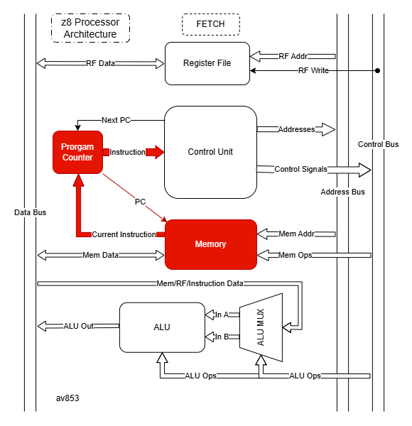

# z8 Processor Core
## Overview
An 8-bit RISC processor written in System Verilog. It's used to run programs output from my [z8 Assembler](../z8Assembler_v2).  
I built it from scratch to learn more about computer architecture, assemblers, and digital logic. It successfuly executes programs including an example Fibonacci series.

[](https://youtu.be/vuQimqax7PA)

## How to use
You need a system-verilog simulator installed. I use Modelsim for waveforms and Icarus Verilog for output dumps.
### Run the simulation
In the command prompt, with Icarus Verilog installed, run the `sim.bat` file with  
```bash
sim
```
You will get a hex-dump of the data memory, the register states, and the flag state at the end of the program.  

For Modelsim, just don't!

### Change the loaded program
The currently loaded program is found in `/programs/`. To change which one is loaded, open `memory_manager.sv` and change the arg for `readmemh$`.   
N.B. `readmemh$` is not always synthesizeable.  
N.B because of the location Modelsim runs the testbench from, relative addressing for loading `.hex` files does not work. Instead, copy the absolute path to that file. This does not apply to Icarus Verilog simulations

## Specifications
8-bit data width  
40-bit instructions (5-byte format)  
4 general purpose registers indexed R0-R3
256 byte data memory, stack starts at 0xFF and grows downwards  
31 opcodes total, with 18 individual instructions  

## Architecture

|Block diagram|Fetch-Decode-Execute-Writeback cycle|
|:---:|:---:|
|  |  |

The z8 processor uses a Harvard-style architecture with seperate data and program memory.   
Variables are not directly seen by the processor, instead the assembler computes addresses and prevents collisions. They live in data memory.  
The architecture is setup so that as little (ideally none) of the data is handled by the CU, which instead deals exclusively with addresses and control signals.

### Control Unit
Coordinates other modules to perform a task. Primarily driven by clock updates. It takes in the current instruction and state, switches to find the correct set of output values, and applies them to the right wires.  
For example, `ADR` (Add register).  
#### Fetch
The `program_counter` points to the next instruction. The `Memory Manager` combinatorially outputs the `current_instruction`, which goes straight to the `Control Unit`.
#### Decode 
The `Control Unit` sets `rf_read_addr_a` to the address given by the destination portion of the instruction (the register to add to), and sets `rf_read_addr_b` to the address given by the source (the register to add from). The `Register File` is combinatorial, and immediately takes these addresses in and spits out the data in these registers to `rf_read_data_a` and `rd_read_data_b`.   
#### Execute
The `Control Unit` sets three control signals, `alu_op <= ALU_ADD` to tell the ALU to perform an adding operation on the two inputs,   and `alu_a_src_sel <= REG` and `alu_b_src_sel <= REG` to tell the ALU that the data coming in is from the `Register File` so read the data out from the `Register File`.  The ALU is combinatorial and outputs the result of the operation immediately.
#### Writeback
The `Control Unit` sets `rf_write_enable` to high, which tells the `Register File` to the data it gets to the selected register. The `Control Unit` also sets `rf_write_addr` to the destination portion of the instruction, to tell the `Register File` to write to that register.
