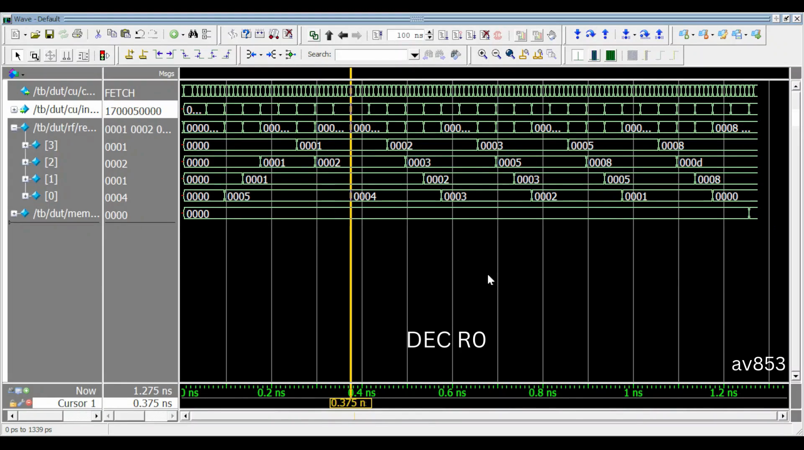
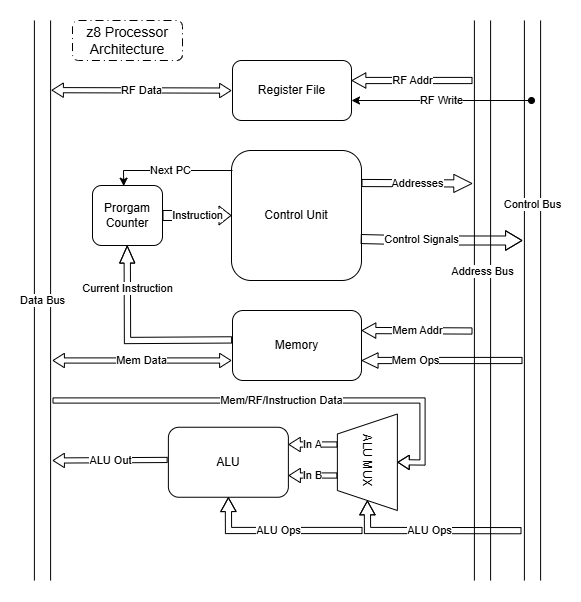

# z8 Processor Core
## Overview
An 8-bit RISC processor written in System Verilog. It's used to run programs output from my [z8 Assembler](../z8Assembler_v2).  
I built it from scratch to learn more about computer architecture, assemblers, and digital logic. It successfuly executes programs including an example Fibonacci series.

[](https://youtu.be/vuQimqax7PA)

## How to use
You need a system-verilog simulator installed. I use Modelsim for waveforms and Icarus Verilog for output dumps.
### Run the simulation
In the command prompt, with Icarus Verilog installed, run the `sim.bat` file with  
```bash
sim
```
You will get a hex-dump of the data memory, the register states, and the flag state at the end of the program.  

For Modelsim, just don't!

### Change the loaded program
The currently loaded program is found in `/programs/`. To change which one is loaded, open `memory_manager.sv` and change the arg for `readmemh$`.   
N.B. `readmemh$` is not always synthesizeable.  
N.B because of the location Modelsim runs the testbench from, relative addressing for loading `.hex` files does not work. Instead, copy the absolute path to that file. This does not apply to Icarus Verilog simulations

## Specifications
8-bit data width  
40-bit instructions (5-byte format)  
4 general purpose registers indexed R0-R3
256 byte data memory, stack starts at 0xFF and grows downwards  
31 opcodes total, with 18 individual instructions  

## Architecture
  
The z8 processor uses a Harvard-style architecture with seperate data and program memory.   
The architecture is setup so that as little (ideally none) of the data is handled by the CU, which instead deals exclusively with addresses and control signals.
